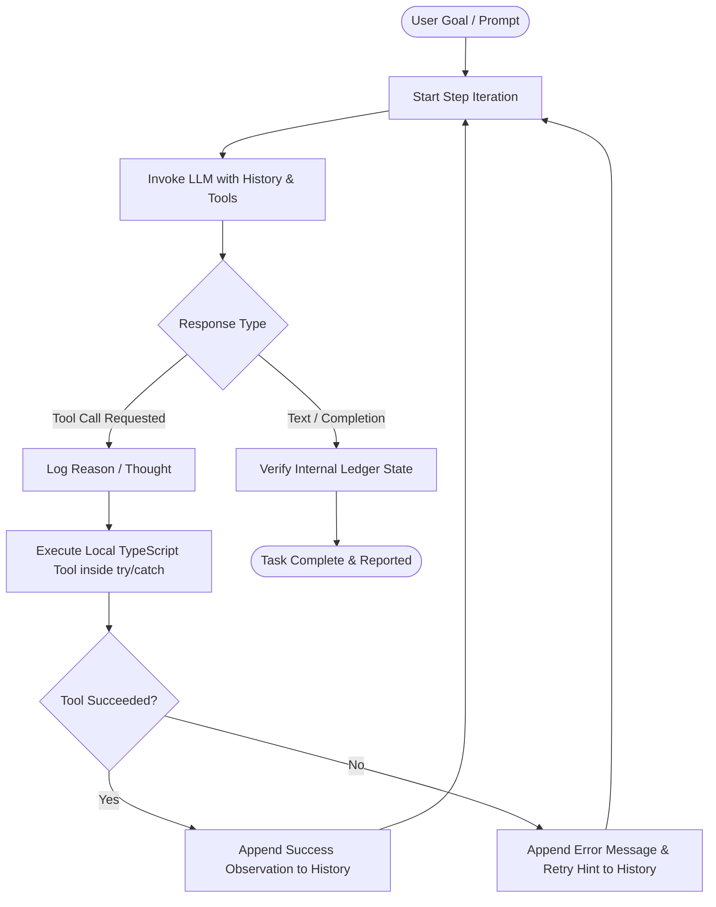

# 🤖 Autonomous AI Task Worker (ReAct Prototype)

An enterprise-grade, lightweight, zero-framework autonomous agent prototype built with **TypeScript**, **Node.js**, and native LLM function calling (supporting **Claude 3.5/3.7 Sonnet** and **GPT-4o**). 

This prototype solves multi-step enterprise workflows using a pure **ReAct (Reason + Act)** loop with deterministic error recovery, self-healing, and end-state verification.

---

## 🎯 Target Scenario

> *"Find the latest invoice from Company X, extract the amount and due date, enter it into our internal system, and tell me once it is done."*

---

## 🏗️ Architecture & ReAct Loop

Unlike monolithic frameworks (such as LangChain or AutoGen) that obscure prompt mechanics and state mutations, this prototype implements the **ReAct (Reason + Act)** loop from foundational principles.



### 1. State Management
- **Conversation State**: Managed as an ordered array of messages containing User Prompts, Assistant Thoughts, Native Tool Calls, and Tool Execution Observations (`tool_result` / `tool`).
- **Bounded Iterations**: Hard execution limit (`MAX_AGENT_STEPS`, default: 15) guarantees that the agent cannot enter an infinite loop or drain API token budgets.
- **Provider Agnostic**: Unified abstraction layer (`LLMClient`) dynamically translates between Anthropic's `input_schema`/`tool_use` format and OpenAI's `tools.function` format.

---

## 🛡️ Error Recovery & Self-Healing Mechanics

In production environments, external APIs and databases experience transient network timeouts (`HTTP 504`), socket resets, and intermittent outages.

### How this Agent Recovers:
1. **Defensive Wrapper**: Every tool invocation is wrapped in a granular `try/catch` block.
2. **Error Serialization**: The raw error message (e.g. `[TRANSIENT_ERROR_504] Internal Ledger Gateway Timeout...`) is formatted into the observation payload rather than terminating the Node.js runtime.
3. **Cognitive Feedback**: The agent receives the error as an environmental observation. Guided by the system prompt, the LLM analyzes the error, recognizes that it was a transient failure, and autonomously attempts a retry without human intervention.
4. **Verification**: Before completing the task, the agent verifies the transaction ID returned by the internal ledger.

---

## 📁 Repository Structure

```
.
├── mock_data/                                 # Simulated local file store
│   ├── invoice_company_x_2024_11.json         # Company X (Older date)
│   ├── invoice_company_x_2025_01.json         # Company X (Older date)
│   ├── invoice_company_x_2025_03.json         # Company X (LATEST: $7,820.50, due 2025-04-22)
│   ├── invoice_company_y_2025_02.txt          # Company Y (Distractor)
│   └── invoice_company_z_2025_03.json         # Company Z (Distractor)
│
├── src/
│   ├── agent/
│   │   ├── agent.ts                           # ReAct execution loop & lifecycle logger
│   │   └── system_prompt.ts                   # Step-by-step reasoning instructions
│   │
│   ├── llm/
│   │   └── provider.ts                        # Native Anthropic & OpenAI API abstraction
│   │
│   ├── mock_env/
│   │   ├── internal_system.ts                 # Simulated ERP Ledger with flaky error injection
│   │   └── internal_system.test.ts            # Zero-cost local integration test
│   │
│   ├── tools/
│   │   ├── definitions.ts                     # JSON Schemas for tools
│   │   ├── handlers.ts                        # TypeScript tool implementations
│   │   └── types.ts                           # Shared TypeScript interfaces
│   │
│   └── index.ts                               # CLI Entrypoint & post-run audit
│
├── .env.example                               # Environment template
├── package.json                               # Dependencies & scripts
└── tsconfig.json                              # TypeScript strict configuration
```

---

## 🛠️ Tools Available to the Agent

| Tool Name | Parameters | Description |
| :--- | :--- | :--- |
| `list_files` | `directory_path: string` | Scans a directory and returns names, file types, and file sizes. |
| `read_file` | `file_path: string` | Safely reads the text or JSON content of any file. |
| `submit_to_internal_system` | `company: string`, `amount: number`, `due_date: string` | Validates and commits invoice records to the corporate ledger. |

---

## 🚀 Getting Started

### 1. Prerequisites
- **Node.js** v18+ (v20+ recommended)
- **npm** v9+

### 2. Installation
```bash
git clone <repo-url>
cd "Autonomous AI Task Worker"
npm install
```

### 3. Configure API Keys
Copy `.env.example` to `.env`:
```bash
cp .env.example .env
```
Edit `.env` with your API key:
```ini
# Choose 'anthropic' or 'openai'
LLM_PROVIDER=anthropic

# For Anthropic Claude (e.g. Claude 3.5 Sonnet)
ANTHROPIC_API_KEY=sk-ant-api03-...
ANTHROPIC_MODEL=claude-3-5-sonnet-20241022

# OR for OpenAI
OPENAI_API_KEY=sk-...
OPENAI_MODEL=gpt-4o

# Set to 1 to simulate a 504 network error on the first submit attempt
SIMULATE_TRANSIENT_ERRORS=1
```

---

## 🧪 Running the Code

### Run the Autonomous Agent (Live LLM)
```bash
npm run dev
```

### Run Local Mock & Error Recovery Tests (No LLM Tokens Needed)
```bash
npm run test:env
```

### Compile Production Build
```bash
npm run build
npm start
```

---

## 🔍 Step-by-Step Execution Trace Walkthrough

When running the scenario, the agent executes the following autonomous sequence:

1. **Step 1 (Explore Directory)**:
   - *Thought*: "I need to inspect `mock_data` to locate all invoices and identify files belonging to Company X."
   - *Action*: `list_files({ directory_path: "mock_data" })`
   - *Observation*: Returns 5 files (`invoice_company_x_2024_11.json`, `invoice_company_x_2025_01.json`, `invoice_company_x_2025_03.json`, etc.).

2. **Step 2 (Read Candidate Invoices)**:
   - *Thought*: "I see three invoices for Company X. I must inspect their issue dates to determine which one is the latest."
   - *Action*: `read_file({ file_path: "mock_data/invoice_company_x_2025_03.json" })`
   - *Observation*: Issue date: `2025-03-22`, Total: `$7,820.50`, Due Date: `2025-04-22`.

3. **Step 3 (Submit to Ledger - Injected Flake)**:
   - *Thought*: "The latest invoice is from March 2025. Now submitting to the internal ledger."
   - *Action*: `submit_to_internal_system({ company: "Company X", amount: 7820.50, due_date: "2025-04-22" })`
   - *Observation (Error)*: `[TRANSIENT_ERROR_504] Internal Ledger Gateway Timeout... Please retry.`

4. **Step 4 (Autonomous Self-Healing / Retry)**:
   - *Thought*: "The database reported a transient 504 Gateway Timeout. I will immediately retry the submission."
   - *Action*: `submit_to_internal_system({ company: "Company X", amount: 7820.50, due_date: "2025-04-22" })`
   - *Observation (Success)*: Transaction `TXN-...` recorded with status `PROCESSED`.

5. **Step 5 (Final Answer & Report)**:
   - *Thought*: "Invoice recorded and verified in the database. Generating final confirmation for the user."
   - *Final Response*: "Successfully processed the latest invoice for Company X (Amount: $7,820.50, Due Date: 2025-04-22) into the internal ledger (Transaction ID: TXN-...). Task verified and complete."

---

## ⚠️ Known Limitations & Future Roadmap

| Area | Current Prototype | Production Roadmap |
| :--- | :--- | :--- |
| **Storage** | In-memory `Map` with mock JSON/TXT files | Distributed SQL (PostgreSQL/Prisma) + S3 file bucket |
| **Idempotency** | Single-session memory tracking | Idempotency keys (`Idempotency-Key` header) & distributed locks |
| **Tool Concurrency** | Sequential tool execution per step | Parallel tool execution for batch reading files |
| **Human-in-the-Loop** | Fully autonomous | Configurable approval gates for invoices over specific thresholds (e.g. > $10k) |
| **Context Window** | Keeps full history up to max steps | Rolling context window summarization for long-horizon tasks |

---

## 📄 License
MIT License. Built for technical evaluation.
